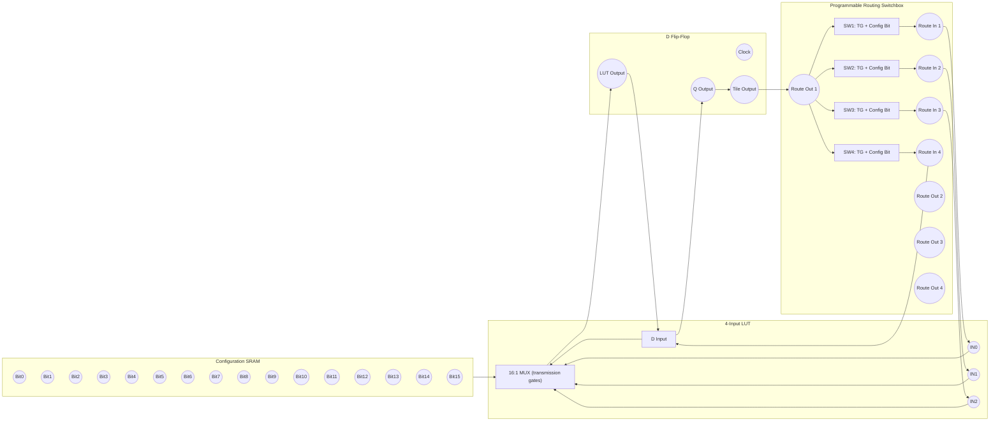

Building an “FPGA” out of discrete CMOS MOSFETs, but in practice it’s hugely expensive, huge, slow, and fiddly. What you *can* do practically is build a tiny, educational prototype FPGA (a few LUTs + a flip-flop + a small programmable switchbox) to learn how real FPGAs work. Below I explain how, what the hard parts are, and a tiny worked example (with transistor counts) so you can see the scale.

# What an FPGA actually needs (high level)

An FPGA fabric tile usually contains:

* **LUT(s)** (lookup tables) — implement arbitrary combinational logic (stored truth table).
* **Flip-flops / registers** — to store state / create synchronous circuits.
* **Programmable routing / switch matrix** — connects LUT outputs to inputs of other LUTs/FFs.
* **Configuration memory** — bits that program LUT truth tables and routing (commonly SRAM cells).
* **Clocking, buffers, I/O** — distribution and I/O cells.

Each of those can be built from MOSFETs (static CMOS logic, transmission gates, 6-T SRAM cells, etc.). So nothing magical prevents a discrete implementation.

# Why people don’t build full FPGAs from discrete transistors

* **Area:** an FPGA implemented from discrete MOSFETs would be physically enormous. Modern FPGAs use lithography to pack millions–billions of transistors in mm².
* **Speed:** long metal traces and discrete wiring → large parasitic capacitances, slow signals, limited clock frequency.
* **Power & reliability:** huge leakage and dynamic power; many hand-soldered/wired connections are fragile.
* **Complexity:** routing is the worst scaling cost — the number of programmable interconnects explodes.
* **Configuration storage:** building thousands of 6-T SRAM cells from discrete MOSFETs is tedious; using discrete nonvolatile memory is even harder.

So a full-featured, useful FPGA (anything like commercial devices) is impractical with discrete MOSFETs, but a small educational fabric is very doable.

# A realistic small project (what I recommend)

Build a tiny “FPGA tile” you can actually finish and test:

* Make **one 4-input LUT** (so it can implement any 4-input logic).
* Add **one D flip-flop** for the LUT output.
* Add a small **programmable switchbox** of a few routing channels (say 8 programmable connections).
* Use **SRAM-based configuration** but either:

  * Implement the SRAM **with a small SRAM chip** (e.g., 6116/6264) to avoid building 6-T cells from individual MOSFETs, **or**
  * Build a few 6-T SRAM cells from discrete CMOS for learning.
* Use **CD4007 (or discrete enhancement FETs like 2N7002 / BS170 and complementary P types)** for inverters/transmission gates — CD4007 gives compact MOS transistor pairs useful for hand-built CMOS logic.
* Make a simple configuration load interface (SPI or parallel) implemented with a microcontroller or manual switches.

This gives you a demonstrable device that you can reprogram and observe.

# Worked example — scale & transistor count for *one* 4-input LUT tile

I’ll do a small arithmetic-backed estimate so you see scaling. We'll build a tile with:

* one 4-input LUT (truth table stored in SRAM)
* one D flip-flop
* ~8 programmable routing switches (small local routing)

Step 1 — LUT configuration memory:

* A 4-input LUT needs (2^4 = 16) configuration bits (one bit per truth-table entry).
* If you implement each config bit with a standard 6-transistor SRAM cell:
  16 bits × 6 transistors/bit = 96 transistors.

* $(2^4 = 16)$.
* $(16 \times 6 = 96)$.

Step 2 — LUT output multiplexing:

* A 4-input LUT can be realized by storing 16 bits and using a 16:1 multiplexer to select the output. A 16:1 mux implemented as a binary tree of 2:1 transmission-gate muxes requires 15 two-input mux nodes.
* If each 2:1 node is implemented with a transmission gate pair ≈ 2 MOSFETs (one NMOS + one PMOS), then approx:
  15 nodes × 2 transistors/node = 30 transistors.

* $(15 \times 2 = 30)$.

Step 3 — D flip-flop (edge-triggered, static CMOS master-slave):

* A typical static CMOS D-FF is on the order of 20–30 transistors. We'll pick 24 as a representative estimate.

Step 4 — routing / programmable switches:

* Suppose you provide 8 programmable connections in the local switchbox.
* Each switch is a transmission gate (≈2 transistors), and each programmable switch needs a config bit to control it (6T SRAM), unless you store many config bits in a central chip.
* So per switch: 2 (transmission gate) + 6 (SRAM) = 8 transistors. For 8 switches:
  8 switches × 8 transistors/switch = 64 transistors.

* $(8 \times 8 = 64)$.

Step 5 — add up the pieces:

* LUT SRAM: 96
* LUT mux: 30
* D-FF: 24
* Routing: 64

Total: (96 + 30 + 24 + 64 = 214) transistors for this tiny tile.

* (96 + 30 = 126).
* (126 + 24 = 150).
* (150 + 64 = 214).

So a single tiny FPGA tile is already on the order of a few hundred transistors if you build a bit of the config memory yourself. Scale that to even 16 tiles and you’re in the multiple-thousands of transistors, and routing requirements start to dominate.

# Practical shortcuts / things that make it manageable

If you want a working project instead of hand-wiring thousands of MOSFETs, consider mixing in some off-the-shelf parts:

* Use small **SRAM chips**, e.g., an 8K × 8 SRAM, to hold all configuration bits — saves building many 6-T cells.
* Use **CD4007** as a transistor array for building gates compactly on perfboard. It contains complementary MOSFETs useful for small CMOS circuits.
* Use **CMOS logic ICs** (74HC, 4000 series) for common logic blocks instead of transistor-level building everywhere.
* Use a microcontroller (Arduino, Teensy, etc.) to **program the configuration memory** via SPI or parallel load.
* Start with *static* programming (power-on load) rather than trying to do dynamic partial reconfiguration.

# Parts & tools suggestions

* MOSFET devices: 2N7002 (small-signal N-MOS), BSS84 or BS250 (small P-MOS), or CD4007 for compact CMOS pairs.
* Small SRAM chips (optional): 6116/62256 or modern SPI SRAM.
* Breadboard/perfboard or a small PCB (I highly recommend making a PCB once schematic stabilizes).
* Oscilloscope / logic analyzer (Saleae) to observe signals.
* Microcontroller to load configuration.

# Learning progression (step-by-step project plan)

1. Build and test basic static CMOS gates (inverter, NAND, NOR) from discrete MOSFETs (or CD4007). Verify thresholds and logic levels.
2. Build a single **6-T SRAM cell** and learn how to read/write it reliably (important learning about noise margins).
3. Build a **2-input LUT** (4 configuration bits) using SRAM + small mux; verify you can program its truth table.
4. Add a **D flip-flop** and clock it; make a small synchronous circuit (e.g., a 1-bit counter).
5. Implement a couple of **programmable switches** and build a 2-tile network so you can route one LUT into another.
6. If comfortable, scale to 4-input LUT + a few tiles. Move to PCB for cleanliness and speed.

# Alternatives that give the same learning payoff but are far more practical

* Buy a cheap FPGA dev board (Lattice iCE40, Intel/Altera MAX 10, or low-cost Xilinx) and examine the bitstream and routing behavior. You’ll learn the same concepts and can experiment with toolchains.
* Build an FPGA *emulator* in software or on a microcontroller: implement LUTs and routing in software and control I/O pins for learning reconfiguration without soldering thousands of transistors.

# Final verdict

* **Yes:** you *can* make an FPGA from discrete CMOS MOSFETs if your goal is education and small experiments.
* **No:** you should not expect to build anything near the size, speed, or practicality of silicon FPGAs.
* **Recommended:** start tiny (1–4 LUTs), use SRAM chips or CD4007 for convenience, and focus on learning SRAM, muxing, flip-flops, and routing techniques.

---

A **conceptual CMOS FPGA tile schematic** in **Mermaid** syntax so you can visualize how the transistor-level building blocks connect.

This is not transistor-by-transistor (that would be hundreds of MOSFETs) — instead it shows **logic-level hierarchy** for a single *4-input LUT + D flip-flop + routing switchbox* tile.

---

### 🧩 FPGA Tile Schematic (Mermaid Diagram)

---

### 🔍 Explanation of the Diagram

| Block                  | Function                                       | Built From                                              |
| ---------------------- | ---------------------------------------------- | ------------------------------------------------------- |
| **Configuration SRAM** | Stores LUT bits and routing enable bits        | 6T CMOS cells (each = 2 inverters + 2 pass transistors) |
| **4-Input LUT**        | Selects one of 16 config bits using inputs A–D | Tree of 2:1 transmission-gate MUXes                     |
| **D Flip-Flop**        | Registers the LUT output on clock edge         | Master–slave pair of gated latches                      |
| **Switchbox**          | Allows programmable connections between tiles  | Transmission gates + config SRAM bits                   |

---

### 🧠 Implementation Tips

* Each **transmission gate (TG)** = 1 NMOS + 1 PMOS controlled by config bit and its complement.
* Each **SRAM bit** can be emulated initially using DIP switches or 74HC595 shift registers to avoid wiring 6T cells by hand.
* Start small: try making a **2-input LUT (4 bits)** before a 4-input one.

# :books: References

- [ ] [Activity : Build CMOS Logic Functions Using CD4007 Array](https://wiki.analog.com/university/courses/alm1k/alm-lab-28)
