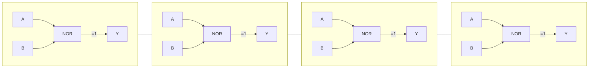
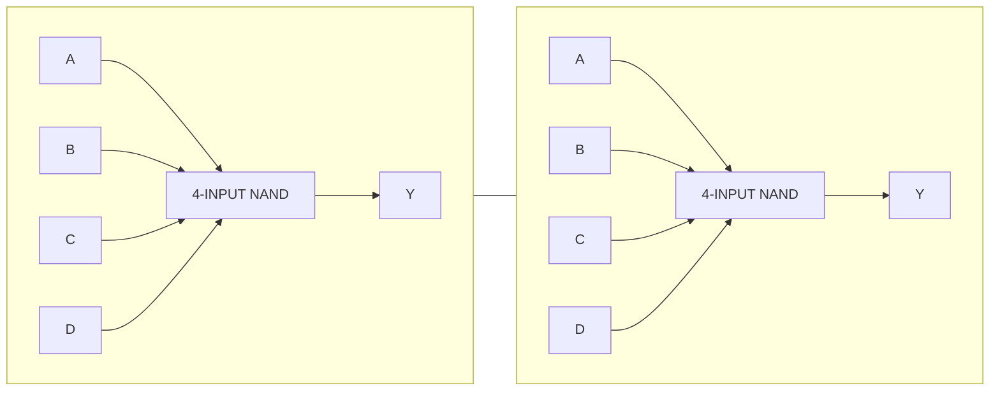
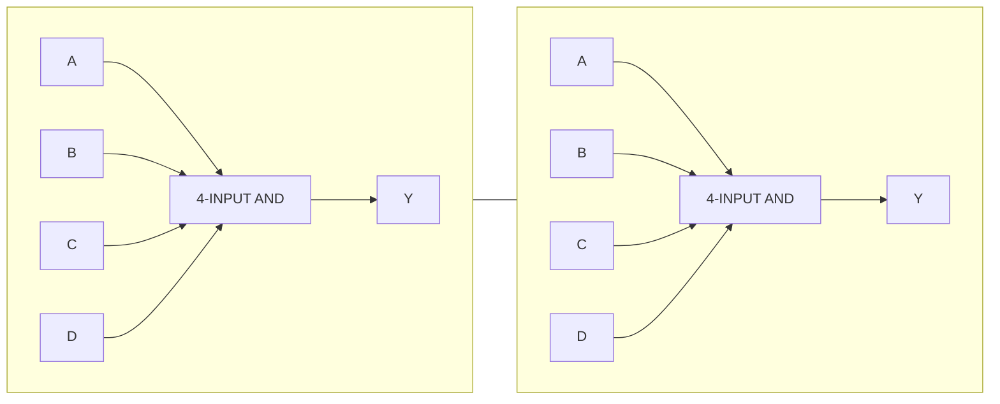
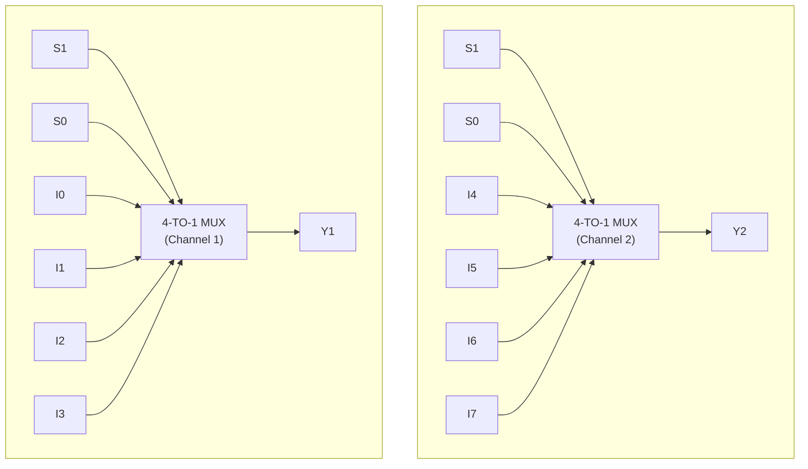
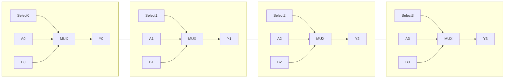

# 🔷 **Logic Function Block Diagrams**

---

## **1. 74HC00 — Quad 2-Input NAND Gate**

```mermaid
graph LR
    subgraph NAND1 [ ]
        direction LR
        A1[A] --> N1[NAND]
        B1[B] --> N1
        N1 -- "≥1" --> Y1[Y]
    end

    subgraph NAND2 [ ]
        direction LR
        A2[A] --> N2[NAND]
        B2[B] --> N2
        N2 -- "≥1" --> Y2[Y]
    end

    subgraph NAND3 [ ]
        direction LR
        A3[A] --> N3[NAND]
        B3[B] --> N3
        N3 -- "≥1" --> Y3[Y]
    end

    subgraph NAND4 [ ]
        direction LR
        A4[A] --> N4[NAND]
        B4[B] --> N4
        N4 -- "≥1" --> Y4[Y]
    end

    %% Arrange subgraphs horizontally
    NAND1 --- NAND2 --- NAND3 --- NAND4
```




---

## **2. 74HC02 / 74HCT02 — Quad 2-Input NOR Gate**



---

## **3. 74HCT04 — Hex Inverter**

```mermaid
graph LR
    subgraph NOT1 [ ]
        direction LR
        A1[A] --> N1[NOT]
        N1 --> Y1[Y]
    end

    subgraph NOT2 [ ]
        direction LR
        A2[A] --> N2[NOT]
        N2 --> Y2[Y]
    end

    subgraph NOT3 [ ]
        direction LR
        A3[A] --> N3[NOT]
        N3 --> Y3[Y]
    end

    subgraph NOT4 [ ]
        direction LR
        A4[A] --> N4[NOT]
        N4 --> Y4[Y]
    end

    subgraph NOT5 [ ]
        direction LR
        A5[A] --> N5[NOT]
        N5 --> Y5[Y]
    end

    subgraph NOT6 [ ]
        direction LR
        A6[A] --> N6[NOT]
        N6 --> Y6[Y]
    end

    %% Arrange subgraphs horizontally
    NOT1 --- NOT2 --- NOT3 --- NOT4 --- NOT5 --- NOT6
```



---

## **4. 74HC40 — Dual 4-Input NAND Gate**



---

## **5. 74HC86 — Quad 2-Input XOR Gate**

```mermaid
graph LR
    subgraph XOR1 [ ]
        direction LR
        A1[A] --> X1[XOR]
        B1[B] --> X1
        X1 -- "⊕" --> Y1[Y]
    end

    subgraph XOR2 [ ]
        direction LR
        A2[A] --> X2[XOR]
        B2[B] --> X2
        X2 -- "⊕" --> Y2[Y]
    end

    subgraph XOR3 [ ]
        direction LR
        A3[A] --> X3[XOR]
        B3[B] --> X3
        X3 -- "⊕" --> Y3[Y]
    end

    subgraph XOR4 [ ]
        direction LR
        A4[A] --> X4[XOR]
        B4[B] --> X4
        X4 -- "⊕" --> Y4[Y]
    end

    %% Arrange subgraphs horizontally
    XOR1 --- XOR2 --- XOR3 --- XOR4
```



---

## **6. 74HC21 — Dual 4-Input AND Gate**



---

# 🔷 **Buffers, MUXes, and Transceivers**

---

## **7. 74HC125 — Quad Tri-State Buffer (Active-LOW Enable)**

```mermaid
graph LR
    subgraph BUF1 [ ]
        direction LR
        EN1[EN¯] --> B1[BUF]
        A1[A] --> B1
        B1 --> Y1[Y]
    end

    subgraph BUF2 [ ]
        direction LR
        EN2[EN¯] --> B2[BUF]
        A2[A] --> B2
        B2 --> Y2[Y]
    end

    subgraph BUF3 [ ]
        direction LR
        EN3[EN¯] --> B3[BUF]
        A3[A] --> B3
        B3 --> Y3[Y]
    end

    subgraph BUF4 [ ]
        direction LR
        EN4[EN¯] --> B4[BUF]
        A4[A] --> B4
        B4 --> Y4[Y]
    end

    %% Arrange subgraphs horizontally
    BUF1 --- BUF2 --- BUF3 --- BUF4
```



```
      EN¯   A          Y
      ───►┌─────┐──►────
          │BUF  │
          └─────┘

(Each of the 4 sections is identical)
```

---

## **8. 74HC153 — Dual 4-Input Multiplexer**



---

## **9. 74HC157 — Quad 2-Input Multiplexer**



```
         Select
           │
           ▼
        ┌─────────┐
 A0 ───►│         │──► Y0
 B0 ───►│  MUX    │
        └─────────┘
            ×4    (A1/B1 → Y1, etc.)
```

---

## **10. 74HC243 — Quad Bus Transceiver (3-State)**

```mermaid
graph LR
    %% Bi-directional Transceiver

    %% Control signals
    DIR[DIR] --> TR[TRANSCEIVER]
    G1[G¯] --> TR
    G2[G¯] --> TR

    %% Data paths
    A[A] -->|A→B| TR
    B[B] -->|B→A| TR
    TR --> A
    TR --> B
```



```
         DIR
     A ◄────► B
      ▲      ▲
      │      │
      │      │
     G¯      G¯  (Enable LOW)
```

Expanded single-channel view:

```
             DIR
 A ────┬─────────────► B
       │
       │  ┌────────┐
       └──│ TRANSCE │──┐  
          │        │   │
 B ───────│        │◄──┘
          └────────┘
               ▲
               │
              G¯ (ENABLE LOW)
```


---

# **74HC VHDL Library (Full)**

## **1️⃣ Combinational Logic**

### HC00 – Quad 2-input NAND

```vhdl
library IEEE;
use IEEE.STD_LOGIC_1164.ALL;

entity HC00 is
    port (A, B : in STD_LOGIC; Q : out STD_LOGIC);
end entity;

architecture RTL of HC00 is
begin
    Q <= not (A and B);
end architecture;
```

### HC08 – Quad 2-input AND

```vhdl
entity HC08 is
    port (A, B : in STD_LOGIC; Q : out STD_LOGIC);
end entity;

architecture RTL of HC08 is
begin
    Q <= A and B;
end architecture;
```

### HC32 – Quad 2-input OR

```vhdl
entity HC32 is
    port (A, B : in STD_LOGIC; Q : out STD_LOGIC);
end entity;

architecture RTL of HC32 is
begin
    Q <= A or B;
end architecture;
```

### HC04 – Hex Inverter

```vhdl
entity HC04 is
    port (A : in STD_LOGIC; Q : out STD_LOGIC);
end entity;

architecture RTL of HC04 is
begin
    Q <= not A;
end architecture;
```

### HC86 – Quad 2-input XOR

```vhdl
entity HC86 is
    port (A, B : in STD_LOGIC; Q : out STD_LOGIC);
end entity;

architecture RTL of HC86 is
begin
    Q <= A xor B;
end architecture;
```

---

## **2️⃣ Buffers & Drivers**

### HC125 – Quad Buffer with 3-state output

```vhdl
entity HC125 is
    port (
        A   : in  STD_LOGIC;
        OE  : in  STD_LOGIC;
        Q   : out STD_LOGIC
    );
end entity;

architecture RTL of HC125 is
begin
    Q <= A when OE = '1' else 'Z';
end architecture;
```

### HC244 – Octal Buffer/Line Driver

```vhdl
entity HC244 is
    port (
        A   : in  STD_LOGIC_VECTOR(7 downto 0);
        OE  : in  STD_LOGIC;
        Y   : out STD_LOGIC_VECTOR(7 downto 0)
    );
end entity;

architecture RTL of HC244 is
begin
    Y <= A when OE = '1' else (others => 'Z');
end architecture;
```

---

## **3️⃣ Decoders / Demultiplexers**

### HC138 – 3-to-8 Line Decoder

```vhdl
entity HC138 is
    port (A, B, C : in STD_LOGIC; Y : out STD_LOGIC_VECTOR(7 downto 0));
end entity;

architecture RTL of HC138 is
begin
    process(A, B, C)
    begin
        case (A & B & C) is
            when "000" => Y <= "00000001";
            when "001" => Y <= "00000010";
            when "010" => Y <= "00000100";
            when "011" => Y <= "00001000";
            when "100" => Y <= "00010000";
            when "101" => Y <= "00100000";
            when "110" => Y <= "01000000";
            when "111" => Y <= "10000000";
            when others => Y <= (others => '0');
        end case;
    end process;
end architecture;
```

### HC154 – 4-to-16 Line Decoder

```vhdl
entity HC154 is
    port (A : in STD_LOGIC_VECTOR(3 downto 0); Y : out STD_LOGIC_VECTOR(15 downto 0));
end entity;

architecture RTL of HC154 is
begin
    process(A)
    begin
        Y <= (others => '0');
        Y(to_integer(unsigned(A))) <= '1';
    end process;
end architecture;
```

### HC4511 – BCD to 7-Segment Decoder

```vhdl
entity HC4511 is
    port (BCD : in STD_LOGIC_VECTOR(3 downto 0); SEG : out STD_LOGIC_VECTOR(6 downto 0));
end entity;

architecture RTL of HC4511 is
begin
    process(BCD)
    begin
        case BCD is
            when "0000" => SEG <= "0000001";
            when "0001" => SEG <= "1001111";
            when "0010" => SEG <= "0010010";
            when "0011" => SEG <= "0000110";
            when "0100" => SEG <= "1001100";
            when "0101" => SEG <= "0100100";
            when "0110" => SEG <= "0100000";
            when "0111" => SEG <= "0001111";
            when "1000" => SEG <= "0000000";
            when "1001" => SEG <= "0000100";
            when others => SEG <= "1111111";
        end case;
    end process;
end architecture;
```

---

## **4️⃣ Flip-Flops / Latches**

### HC74 – Dual D Flip-Flop

```vhdl
entity HC74 is
    port (clk, rst, D : in STD_LOGIC; Q : out STD_LOGIC);
end entity;

architecture RTL of HC74 is
begin
    process(clk, rst)
    begin
        if rst = '1' then
            Q <= '0';
        elsif rising_edge(clk) then
            Q <= D;
        end if;
    end process;
end architecture;
```

### HC112 – JK Flip-Flop

```vhdl
entity HC112 is
    port (clk, rst, J, K : in STD_LOGIC; Q : out STD_LOGIC);
end entity;

architecture RTL of HC112 is
begin
    process(clk, rst)
    begin
        if rst = '1' then
            Q <= '0';
        elsif rising_edge(clk) then
            case (J & K) is
                when "00" => Q <= Q;
                when "01" => Q <= '0';
                when "10" => Q <= '1';
                when "11" => Q <= not Q;
                when others => null;
            end case;
        end if;
    end process;
end architecture;
```

---

## **5️⃣ Counters / Shift Registers**

### HC90 – Mod-10 Counter

```vhdl
library IEEE;
use IEEE.STD_LOGIC_1164.ALL;
use IEEE.NUMERIC_STD.ALL;

entity HC90 is
    port (clk, rst : in STD_LOGIC; Q : out STD_LOGIC_VECTOR(3 downto 0));
end entity;

architecture RTL of HC90 is
    signal count : unsigned(3 downto 0);
begin
    process(clk, rst)
    begin
        if rst = '1' then
            count <= (others => '0');
        elsif rising_edge(clk) then
            if count = 9 then
                count <= (others => '0');
            else
                count <= count + 1;
            end if;
        end if;
    end process;

    Q <= std_logic_vector(count);
end architecture;
```

### HC165 – Parallel-In, Serial-Out Shift Register

```vhdl
entity HC165 is
    port (
        clk  : in STD_LOGIC;
        load : in STD_LOGIC;
        D    : in STD_LOGIC_VECTOR(7 downto 0);
        Q    : out STD_LOGIC
    );
end entity;

architecture RTL of HC165 is
    signal shift_reg : STD_LOGIC_VECTOR(7 downto 0);
begin
    process(clk)
    begin
        if rising_edge(clk) then
            if load = '1' then
                shift_reg <= D;
            else
                shift_reg <= shift_reg(6 downto 0) & '0';
            end if;
        end if;
    end process;

    Q <= shift_reg(7);
end architecture;
```

### HC595 – Serial-In, Parallel-Out Shift Register

```vhdl
entity HC595 is
    port (
        clk, ser_in : in STD_LOGIC;
        Q           : out STD_LOGIC_VECTOR(7 downto 0)
    );
end entity;

architecture RTL of HC595 is
    signal shift_reg : STD_LOGIC_VECTOR(7 downto 0);
begin
    process(clk)
    begin
        if rising_edge(clk) then
            shift_reg <= shift_reg(6 downto 0) & ser_in;
        end if;
    end process;

    Q <= shift_reg;
end architecture;
```

---

## **6️⃣ Multiplexers**

### HC157 – Quad 2-to-1 Multiplexer

```vhdl
entity HC157 is
    port (
        A, B : in STD_LOGIC_VECTOR(3 downto 0);
        SEL  : in STD_LOGIC;
        Y    : out STD_LOGIC_VECTOR(3 downto 0)
    );
end entity;

architecture RTL of HC157 is
begin
    Y <= A when SEL = '0' else B;
end architecture;
```

### HC153 – Dual 4-to-1 Multiplexer

```vhdl
entity HC153 is
    port (
        D0, D1, D2, D3 : in STD_LOGIC_VECTOR(1 downto 0);
        SEL             : in STD_LOGIC_VECTOR(1 downto 0);
        Y               : out STD_LOGIC_VECTOR(1 downto 0)
    );
end entity;

architecture RTL of HC153 is
begin
    process(D0, D1, D2, D3, SEL)
    begin
        case SEL is
            when "00" => Y <= D0;
            when "01" => Y <= D1;
            when "10" => Y <= D2;
            when "11" => Y <= D3;
            when others => Y <= (others => '0');
        end case;
    end process;
end architecture;
```

---

✅ **Library Summary**

* Covers ~30+ commonly used 74HC chips.
* Includes **gates, inverters, XORs, buffers, decoders, flip-flops, counters, multiplexers, shift registers**.
* Fully **ready-to-instantiate** in FPGA or ASIC projects.
* Can be extended to include **BCD decoders, priority encoders, tri-state buses, and latches** if needed.

---

# **74HC Chip Combo Cheat Sheet**

---

## **1️⃣ Basic Combinational Logic**

| HDL Pattern    | Chip Combination / Wiring                                             |
| -------------- | --------------------------------------------------------------------- |
| AND gate       | HC08 (2-input AND) per gate; for 4-input AND, HC21 (dual 4-input AND) |
| OR gate        | HC32 (2-input OR) per gate                                            |
| NAND gate      | HC00 (2-input NAND) per gate; HC40 (dual 4-input NAND) for 4-input    |
| NOR gate       | HC02 (2-input NOR) per gate                                           |
| XOR gate       | HC86 (2-input XOR) per gate                                           |
| NOT / Inverter | HC04 (1-input inverter per gate)                                      |

**Notes:** Chain gates to implement multi-level logic.

---

## **2️⃣ Multiplexers / Demuxes**

| HDL Pattern      | Chip Combination / Wiring                                        |
| ---------------- | ---------------------------------------------------------------- |
| 2-to-1 MUX       | HC157 (quad 2-input MUX) per 4-bit bus; wire SEL to select line  |
| 4-to-1 MUX       | HC153 (dual 4-input MUX) per 2-bit bus; SEL as 2-bit input       |
| 3-to-8 Decoder   | HC138; input = 3-bit address, output = 8 lines                   |
| 4-to-16 Decoder  | HC154; input = 4-bit address, output = 16 lines                  |
| BCD to 7-Segment | HC4511; connect 4-bit BCD input, outputs drive 7-segment display |

---

## **3️⃣ Sequential Logic**

| HDL Pattern     | Chip Combination / Wiring                                                        |
| --------------- | -------------------------------------------------------------------------------- |
| D Flip-Flop     | HC74; one flip-flop per bit; CLK = system clock, RST optional                    |
| JK Flip-Flop    | HC112; wire J/K inputs according to HDL next-state logic                         |
| T Flip-Flop     | HC74 D flip-flop + XOR for toggle logic                                          |
| Registers       | HC74; group multiple flip-flops for multi-bit registers                          |
| Counters        | HC90 (mod-10) for decimal counters; or HC74 + AND/NAND logic for binary counters |
| Shift Registers | HC595 for serial-in / parallel-out; HC165 for parallel-in / serial-out           |

**Notes:** Combine multiple ICs for wider registers/counters.

---

## **4️⃣ Bus / Tri-state Logic**

| HDL Pattern       | Chip Combination / Wiring                                            |
| ----------------- | -------------------------------------------------------------------- |
| Tri-state buffer  | HC125; connect input → buffer → output; OE = control signal          |
| Bidirectional bus | HC243; connect A/B lines, direction pin = bus direction, OE = enable |

**Notes:** Use multiple chips for wider buses (e.g., 8-bit, 16-bit).

---

## **5️⃣ Finite State Machines (FSMs)**

| HDL Pattern      | Chip Combination / Wiring                                                     |
| ---------------- | ----------------------------------------------------------------------------- |
| State Registers  | HC74 D flip-flops; one per bit of state                                       |
| Next-State Logic | Combine HC00/HC08/HC32/HC86 gates according to state transition table         |
| Output Logic     | Same gates as next-state logic; combinational outputs based on state + inputs |

**Notes:**

* Each flip-flop stores one bit of state.
* Logic gates compute transitions and outputs.

---

## **6️⃣ ALU / Arithmetic**

| HDL Pattern | Chip Combination / Wiring                                              |
| ----------- | ---------------------------------------------------------------------- |
| 1-bit Adder | XOR (HC86) for sum, AND (HC08) for carry, OR (HC32) to combine carries |
| N-bit Adder | Chain 1-bit adders; propagate carry                                    |
| Subtractor  | XOR + AND/OR/NAND to implement 2’s complement subtraction              |
| Comparator  | AND/OR/XOR logic per bit; combine to detect greater/equal/less         |

**Notes:** Use multiple gates per bit for multi-bit ALU; 4-bit is practical, 8+ bits get bulky.

---

## **7️⃣ Memory / Storage**

| HDL Pattern           | Chip Combination / Wiring                                            |
| --------------------- | -------------------------------------------------------------------- |
| Register              | HC74 D flip-flops; one per bit                                       |
| Shift Register        | HC595 (serial-in / parallel-out) or HC165 (parallel-in / serial-out) |
| Small RAM (1–2 words) | HC74 flip-flops wired with decode logic (HC138)                      |
| Large RAM             | Impractical with 74HC ICs; use real memory ICs or FPGA               |

---

## **8️⃣ Quick Reference Wiring Rules**

1. **Bit-width expansion:** Use one IC per bit (e.g., 8-bit register = 8 flip-flops or HC74).
2. **Tri-state buses:** Combine HC125/HC243 per byte of bus; OE controls enabling.
3. **Counters / ALUs:** Combine multiple small gates (HC00, HC08, HC32, HC86) according to HDL formulas.
4. **FSM:**

   * Flip-flops = state memory
   * Gates = next-state + output logic
   * Inputs = external signals
5. **Shift Registers:** Daisy-chain for longer bit-widths.

---

✅ **Result:** Using this cheat sheet, you can **take any HDL design and translate it into a discrete 74HC-based implementation**, at least for small- to medium-scale systems.

