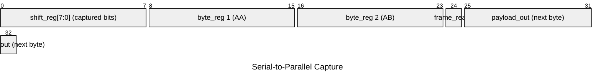

```mermaid
---
title: "Serial-to-Parallel Capture"
---
packet
0-7   : "shift_reg[7:0] (captured bits)"
8-15  : "byte_reg 1 (AA)"
16-23 : "byte_reg 2 (AB)"
24    : "frame_ready"
25-32 : "payload_out (next byte)"
```
