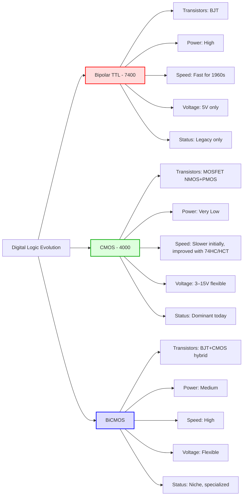

Perfect — let’s break **Bipolar vs CMOS** clearly, step by step. I’ll cover **technology, advantages, disadvantages, and applications**, with historical context.

---

## 1️⃣ **Basic Technology**

| Feature      | Bipolar (TTL / BJT)                  | CMOS (Complementary MOSFET)               |
| ------------ | ------------------------------------ | ----------------------------------------- |
| Transistors  | BJT (bipolar junction transistor)    | MOSFETs (NMOS + PMOS)                     |
| Current Flow | Controlled by **base current**       | Controlled by **gate voltage**            |
| Conducting   | Current flows through both junctions | Very little static current (only leakage) |

---

## 2️⃣ **Power Consumption**

| Feature        | Bipolar                                | CMOS                                      |
| -------------- | -------------------------------------- | ----------------------------------------- |
| Static Power   | High – consumes current even when idle | Very low – almost zero when not switching |
| Dynamic Power  | Moderate                               | Low to moderate (switching only)          |
| Supply Voltage | Typically 5 V                          | Wide: 1.2–15 V depending on part          |

**Why it matters:**

* CMOS = great for battery-powered, low-power devices
* Bipolar = OK for high-speed, less power-sensitive circuits

---

## 3️⃣ **Speed / Switching Time**

| Feature         | Bipolar         | CMOS                                         |
| --------------- | --------------- | -------------------------------------------- |
| Switching Speed | Fast (ns range) | Slower (µs–ns depending on process)          |
| Fan-out         | Moderate        | High (because inputs draw almost no current) |
| Drive Strength  | Good            | Depends on geometry, can be very strong      |

**Summary:**

* Bipolar excels in **high-speed logic**
* CMOS historically slower, but modern CMOS (HC/HCT, BiCMOS) can match or beat TTL speeds

---

## 4️⃣ **Noise Immunity & Logic Levels**

| Feature               | Bipolar             | CMOS                             |
| --------------------- | ------------------- | -------------------------------- |
| Noise Margin          | Moderate            | High                             |
| Input Impedance       | Low – draws current | Extremely high – nearly infinite |
| Susceptibility to EMI | Moderate            | Very robust                      |

**Takeaway:** CMOS is easier to scale and more tolerant of variations.

---

## 5️⃣ **Voltage Flexibility**

| Feature        | Bipolar             | CMOS                                                    |
| -------------- | ------------------- | ------------------------------------------------------- |
| Supply Voltage | Fixed (5 V typical) | Wide (3–15 V for CD4000, down to 1.2 V in modern chips) |
| Output Levels  | TTL compatible only | Flexible                                                |

---

## 6️⃣ **Cost & Integration**

* **Bipolar**: High power → more heat → larger packages → fewer devices per chip
* **CMOS**: Low power → less heat → can integrate millions of transistors → foundation for modern **VLSI / SoC / FPGA**

---

## 7️⃣ **Applications**

| Bipolar (TTL / ECL) | CMOS                  |
| ------------------- | --------------------- |
| Legacy computers    | Microcontrollers      |
| Telecom switches    | Smartphones / tablets |
| Military avionics   | FPGAs, SoCs           |
| High-speed memory   | Low-power IoT sensors |

> Historically, **bipolar ruled 1960s–1970s**, but **CMOS dominates 1980s–today**.

---

## 8️⃣ **Special Hybrid: BiCMOS**

* Combines **bipolar** (output drivers, speed) + **CMOS** (logic, low power)
* Used in:

  * High-speed buffers
  * RF circuits
  * Some microcontrollers / analog ICs

---

### 🧠 Conceptual Summary

* **Bipolar (TTL)** → “fast but power-hungry” → old school logic
* **CMOS** → “slow initially, low-power, scalable” → modern electronics backbone
* **BiCMOS** → “best of both worlds” in niche applications

Perfect! Let’s map the **Bipolar → CMOS → BiCMOS evolution** in a timeline with historical context, tech milestones, and why CMOS won. I’ll make it visual and conceptual.

---

## **Timeline: Bipolar → CMOS → BiCMOS**

```
1960s ──────────────> 1970s ──────────────> 1980s ──────────────> 1990s ──────────────> 2000s–Today
```

---

### **1960s: Bipolar TTL Dominance**

* **Technology:** BJT transistors → Transistor-Transistor Logic (TTL)
* **Family:** 7400 series
* **Characteristics:**

  * Fast for the era (~10–20 ns propagation delay)
  * High static power (~10 mA per IC)
  * Fixed 5 V operation
* **Applications:** Mainframes, telecom, military systems
* **Limitations:**

  * High power → heat issues
  * Hard to integrate many gates → low transistor density

**Why 7400 existed:** Early computers needed **speed and standardization**; CMOS wasn’t mature yet.

---

### **Late 1960s–1970s: CMOS Emergence**

* **Technology:** MOSFETs → Complementary CMOS logic
* **Family:** 4000 series (CD4000)
* **Characteristics:**

  * Very low static power (~µA or less)
  * Wide voltage range (3–15 V)
  * High noise margin & input impedance
  * Slower than TTL initially (~100–1000 ns)
* **Applications:** Battery devices, industrial electronics, space/aerospace
* **Impact:**

  * Showed CMOS could **scale to low-power and high-voltage designs**
  * Coexisted with TTL in parallel ecosystems

---

### **1980s: CMOS Speed Improvements & 74HC / 74HCT**

* **Problem:** TTL was fast, CMOS was slow
* **Solution:**

  * **High-Speed CMOS (74HC)** → faster CMOS logic
  * **HCT** → TTL-compatible inputs, CMOS outputs
* **Result:** CMOS could now **replace TTL in most digital circuits**
* **Applications:** Consumer electronics, microcontrollers, glue logic
* **Significance:** TTL was no longer needed for new designs

---

### **1980s–1990s: BiCMOS Emerges**

* **Technology:** Combines bipolar (for speed) + CMOS (for low power)
* **Applications:**

  * High-speed analog/digital ICs
  * Drivers, buffers, RF circuits
  * Specialized microcontrollers
* **Significance:** **Hybrid solution**, but more expensive → niche adoption

---

### **2000s–Today: CMOS Dominance**

* **Technology:** Advanced CMOS (nanometer processes)
* **Characteristics:**

  * Ultra-low power (~nW idle)
  * Extremely high density → billions of transistors per chip
  * Extremely scalable for VLSI, SoCs, FPGAs
* **Applications:** CPUs, GPUs, FPGAs, smartphones, IoT
* **TTL/Bipolar Status:** Only in **legacy, industrial spares, or some analog cores**

---

### **Visual Summary Table**

| Era         | Technology      | Example Family    | Key Strength                  | Key Weakness                  | Status Today            |
| ----------- | --------------- | ----------------- | ----------------------------- | ----------------------------- | ----------------------- |
| 1960s       | Bipolar TTL     | 7400              | Speed, standardized           | Power-hungry, limited scaling | Legacy only             |
| 1970s       | CMOS            | CD4000            | Low power, wide V             | Slow                          | Still used              |
| 1980s       | High-Speed CMOS | 74HC/HCT          | CMOS power + TTL compat       | Some speed limits             | Dominant logic today    |
| 1980s       | BiCMOS          | Custom ICs        | Speed + low power             | Complex, costly               | Niche/high-speed analog |
| 2000s–2020s | Advanced CMOS   | Modern SoCs/FPGAs | Ultra-low power, high density | Leakage in deep nodes         | Backbone of electronics |

---

### **Key Insights**

1. **Bipolar (TTL)** → first standardized digital logic, fast, but power-hungry
2. **CMOS (4000)** → low power, wide voltage, eventually scalable → won the war
3. **BiCMOS** → compromise, still niche, rarely general-purpose logic
4. **74HC/HCT** → CMOS “adopting TTL pinouts” → unifies the ecosystem
5. **Modern chips** → pure CMOS descendants of 4000 series philosophy

---


