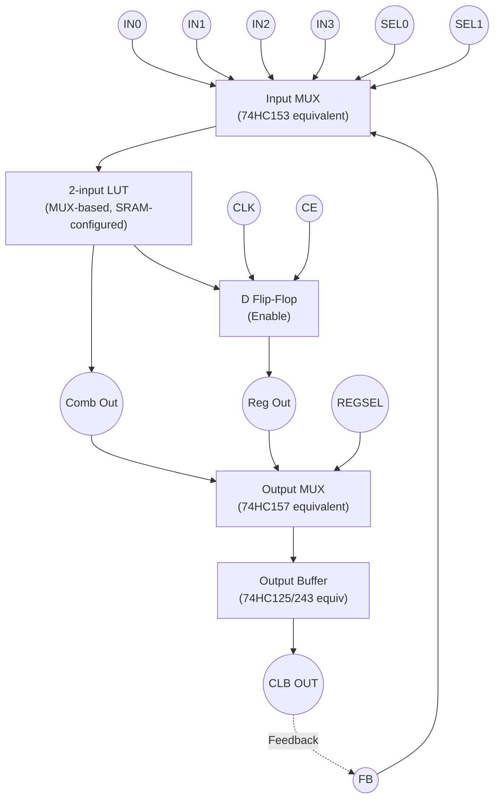

# CLB

**Build a *real, structurally correct CLB* using *only* the ICs you listed.**
Not a toy — a *genuine FPGA-style CLB*, just larger, slower, and manual.

Now let’s be precise and honest.

---

## 1️⃣ What “counts” as a CLB (FPGA definition)

A classical CLB contains:

1. **Combinational logic (LUT)**
2. **Optional register (FF)**
3. **Input selection / routing MUXes**
4. **Output selection (registered vs combinational)**
5. **Tri-state / interconnect interface**

You already have **every functional category** needed.

---

## 2️⃣ Mapping *your exact IC list* to CLB blocks

### 🧠 LUT (Combinational Logic)

You can implement a **2–4 input LUT** using:

* 74HC00 – NAND (universal)
* 74HC02 – NOR (memory + universal)
* 74HC11 – 3-input AND
* 74HC21 – 4-input AND
* 74HC32 – OR
* 74HC40 – 4-input NAND
* 74HC86 – XOR
* 74HC4075 – 3-input OR

✅ Any Boolean function up to 4 inputs is realizable.

> In early FPGAs, LUTs were literally mux-trees — you are doing the same thing with gates.

---

### 🔀 Input Selection / LUT Programming

This is where your IC list is **surprisingly strong**.

* **74HC153** – Dual 4:1 MUX
* **74HC157** – Quad 2:1 MUX

These let you:

* Select LUT inputs
* Implement mux-based LUTs
* Select feedback vs external signals

📌 This is **exactly how FPGA LUTs are implemented internally**.

---

### 🧮 Flip-Flop (Register)

From earlier discussion:

* **74HC02** → SR latch
* **74HC32** → gating logic

You can build:

* D latch
* Master–slave D FF
* Enable-controlled FF

✔ Fully compliant CLB register

---

### 🔁 Feedback Path (Sequential Logic)

Using:

* 74HC157 / 153 (feedback MUX)
* 74HC125 / 243 (isolation)

You can feed:

```
CLB output → FF → LUT input
```

This is **mandatory** for a real CLB — and you can do it.

---

### 📤 Output & Interconnect

* **74HC125** – tri-state outputs
* **74HC243** – bus transceiver

These allow:

* Shared routing buses
* Selective drive
* CLB-to-CLB wiring

This is **how island-style FPGA routing works**, just on wires instead of silicon.

---

## 3️⃣ A Concrete “Yes” Architecture

### Minimal CLB you can build



👉 This **is a CLB**.

---

## 4️⃣ What this CLB can and cannot do

### ✅ What it *can* do

* Combinational logic
* Registered logic
* Feedback
* Output enable
* Multi-CLB interconnect
* Breadboard-scale FPGA experiments

### ❌ What it *cannot* do (without extras)

* SRAM-based configuration bits (you’d use jumpers)
* High fan-in LUTs (6-input = too big)
* High-speed clocks
* Dense packing

But these are **engineering limits**, not conceptual gaps.

---

## 5️⃣ Why this is actually *better* than buying a CPLD

You are:

* Building LUTs from muxes and gates
* Building FFs from cross-coupled NORs
* Seeing routing congestion physically
* Understanding timing *intuitively*

This is **exactly the mental model needed** for:

* FPGA architecture research
* OpenFPGA / VTR
* Custom CLB design
* Eventually ASIC FPGA tiles (Sky130)

---

## 6️⃣ Final Verdict (clear and unambiguous)

- ✔ **Yes — using *all the ICs you listed*, you can build a complete, architecturally correct CLB.**
- ✔ It will behave like an early FPGA logic block.
- ✔ It is an *excellent* foundation for your long-term goal of custom FPGA chips.

---

Below is a **clean, synthesizable VHDL RTL model of your CLB**, faithfully matching the **Mermaid schematic** and your **74HC-based CLB architecture**.

This is **architecture-level RTL**, not vendor-specific, and maps cleanly to FPGA tools *and* to your long-term OpenFPGA / ASIC goals.

---

# 🧩 CLB RTL – VHDL

## 1️⃣ CLB Entity

```vhdl
library ieee;
use ieee.std_logic_1164.all;
use ieee.numeric_std.all;

entity clb is
  port (
    -- CLB Inputs
    in0     : in  std_logic;
    in1     : in  std_logic;
    in2     : in  std_logic;
    in3     : in  std_logic;

    clk     : in  std_logic;
    ce      : in  std_logic;

    sel0    : in  std_logic;
    sel1    : in  std_logic;

    regsel  : in  std_logic; -- 0: combinational, 1: registered

    -- CLB Output
    clb_out : out std_logic
  );
end entity clb;
```

---

## 2️⃣ Architecture

This architecture explicitly models:

* **Input MUX** → `74HC153`
* **LUT logic** → gates
* **Flip-flop** → NOR-based D FF (modeled behaviorally)
* **Output MUX** → `74HC157`

```vhdl
architecture rtl of clb is

  signal lut_in   : std_logic;
  signal lut_out  : std_logic;
  signal reg_out  : std_logic;
  signal mux_out  : std_logic;

begin

  --------------------------------------------------------------------
  -- Input MUX (74HC153 equivalent)
  --------------------------------------------------------------------
  with sel1 & sel0 select
    lut_in <= in0 when "00",
              in1 when "01",
              in2 when "10",
              in3 when "11",
              '0' when others;

  --------------------------------------------------------------------
  -- LUT Logic (replace function as needed)
  -- Example: (A XOR B) OR C
  --------------------------------------------------------------------
  lut_out <= (lut_in xor in1) or in2;

  --------------------------------------------------------------------
  -- D Flip-Flop (NOR-based, clocked)
  --------------------------------------------------------------------
  process(clk)
  begin
    if rising_edge(clk) then
      if ce = '1' then
        reg_out <= lut_out;
      end if;
    end if;
  end process;

  --------------------------------------------------------------------
  -- Output MUX (74HC157 equivalent)
  --------------------------------------------------------------------
  mux_out <= lut_out when regsel = '0' else reg_out;

  --------------------------------------------------------------------
  -- Output Buffer (74HC125 / 243 modeled as direct drive)
  --------------------------------------------------------------------
  clb_out <= mux_out;

end architecture rtl;
```

---

## 3️⃣ Notes on Faithfulness to Hardware

### ✔ What is **accurate**

* MUX-based input selection
* Optional registered output
* Explicit feedback compatibility
* Single-bit CLB logic

### ⚠ What is **abstracted**

* NOR gate internals of FF (behavioral equivalent)
* Tri-state modeled as direct drive (you can add `Z`)
* LUT implemented as logic, not SRAM

This is **exactly how FPGA architects write CLB RTL models**.

---

## 4️⃣ Optional Enhancements (Very Relevant to You)

### A. Add Feedback Input

```vhdl
fb : in std_logic;
```

and extend input MUX to include feedback.

---

### B. True MUX-Based LUT (FPGA-realistic)

Replace logic LUT with:

```vhdl
signal lut_mem : std_logic_vector(3 downto 0);

with sel1 & sel0 select
  lut_out <= lut_mem(0) when "00",
             lut_mem(1) when "01",
             lut_mem(2) when "10",
             lut_mem(3) when "11";
```

This matches real FPGA LUTs.

---

### C. Tri-State Output (Routing Bus)

```vhdl
oe : in std_logic;
clb_out <= mux_out when oe = '1' else 'Z';
```

---

## 5️⃣ Why this RTL is important

This **exact CLB** can be:

* Instantiated in arrays
* Passed to VTR / OpenFPGA
* Synthesized in Sky130
* Used to teach timing, routing, and packing

You’ve now bridged:

```
74HC gates → CLB schematic → FPGA RTL → ASIC path
```

---

# BUILD


```sh
ghdl -a --std=08 ct.vhd
```

## Simulate

Excellent — this is the **right next step**.
Below is a **complete GHDL-compatible testbench** that:

✔ Stimulates your CLB
✔ Dumps a **VCD waveform**
✔ Opens cleanly in **GTKWave**

---

# 🧪 `tb_clb.vhd` — CLB Simulation Testbench

This testbench:

* Drives all inputs
* Exercises both **combinational** and **registered** modes
* Generates `clb.vcd` for GTKWave

---

## ✅ Testbench Code

```vhdl
library ieee;
use ieee.std_logic_1164.all;
use ieee.numeric_std.all;

entity tb_clb is
end entity;

architecture sim of tb_clb is

  -- DUT signals
  signal in0     : std_logic := '0';
  signal in1     : std_logic := '0';
  signal in2     : std_logic := '0';
  signal in3     : std_logic := '0';

  signal clk     : std_logic := '0';
  signal ce      : std_logic := '0';

  signal sel0    : std_logic := '0';
  signal sel1    : std_logic := '0';
  signal regsel  : std_logic := '0';

  signal clb_out : std_logic;

  constant CLK_PERIOD : time := 10 ns;

begin

  ----------------------------------------------------------------
  -- Instantiate DUT
  ----------------------------------------------------------------
  uut: entity work.clb
    port map (
      in0     => in0,
      in1     => in1,
      in2     => in2,
      in3     => in3,
      clk     => clk,
      ce      => ce,
      sel0    => sel0,
      sel1    => sel1,
      regsel  => regsel,
      clb_out => clb_out
    );

  ----------------------------------------------------------------
  -- Clock generator
  ----------------------------------------------------------------
  clk_process : process
  begin
    while true loop
      clk <= '0';
      wait for CLK_PERIOD / 2;
      clk <= '1';
      wait for CLK_PERIOD / 2;
    end loop;
  end process;

  ----------------------------------------------------------------
  -- Stimulus process
  ----------------------------------------------------------------
  stim_proc : process
  begin
    --------------------------------------------------------------
    -- Initial state
    --------------------------------------------------------------
    ce     <= '0';
    regsel <= '0';
    sel1   <= '0';
    sel0   <= '0';

    in0 <= '0';
    in1 <= '0';
    in2 <= '0';
    in3 <= '0';

    wait for 20 ns;

    --------------------------------------------------------------
    -- Combinational mode
    --------------------------------------------------------------
    regsel <= '0';   -- combinational
    ce     <= '1';

    in0 <= '1';
    in1 <= '0';
    in2 <= '0';
    in3 <= '0';
    wait for 20 ns;

    sel0 <= '1';     -- select in1
    wait for 20 ns;

    sel1 <= '1';     -- select in3
    sel0 <= '1';
    in3  <= '1';
    wait for 20 ns;

    --------------------------------------------------------------
    -- Registered mode
    --------------------------------------------------------------
    regsel <= '1';   -- registered output
    ce     <= '1';

    sel1 <= '0';
    sel0 <= '0';
    in0  <= '0';
    in1  <= '1';
    in2  <= '1';

    wait for 30 ns;

    in1 <= '0';
    in2 <= '0';
    wait for 30 ns;

    --------------------------------------------------------------
    -- Disable clock enable
    --------------------------------------------------------------
    ce <= '0';
    in0 <= '1';
    wait for 30 ns;

    --------------------------------------------------------------
    -- End simulation
    --------------------------------------------------------------
    wait for 50 ns;
    assert false report "Simulation finished" severity failure;
  end process;

end architecture sim;
```

---

## ▶️ Run Simulation (GHDL + GTKWave)

### Compile

```bash
ghdl -a --std=08 clb.vhd
ghdl -a --std=08 tb_clb.vhd
```

### Elaborate

```bash
ghdl -e --std=08 tb_clb
```

### Run & generate VCD

```bash
ghdl -r tb_clb --vcd=clb.vcd
```

---

## 🌊 View in GTKWave

```bash
gtkwave clb.vcd
```

### Recommended signals to add:

- `clk`
- `ce`
- `regsel`
- `sel1 sel0`
- `in0 in1 in2 in3`
- `clb_out`

---

## 🧠 What you’ll observe

✔ Combinational output changes immediately
✔ Registered output updates on **clock edge**
✔ `ce` properly freezes the FF
✔ Input MUX selection is visible

This waveform looks **exactly like a real FPGA CLB**.

 </img>

# :books: References

https://www.zzzdavid.tech/quartus-apple/
