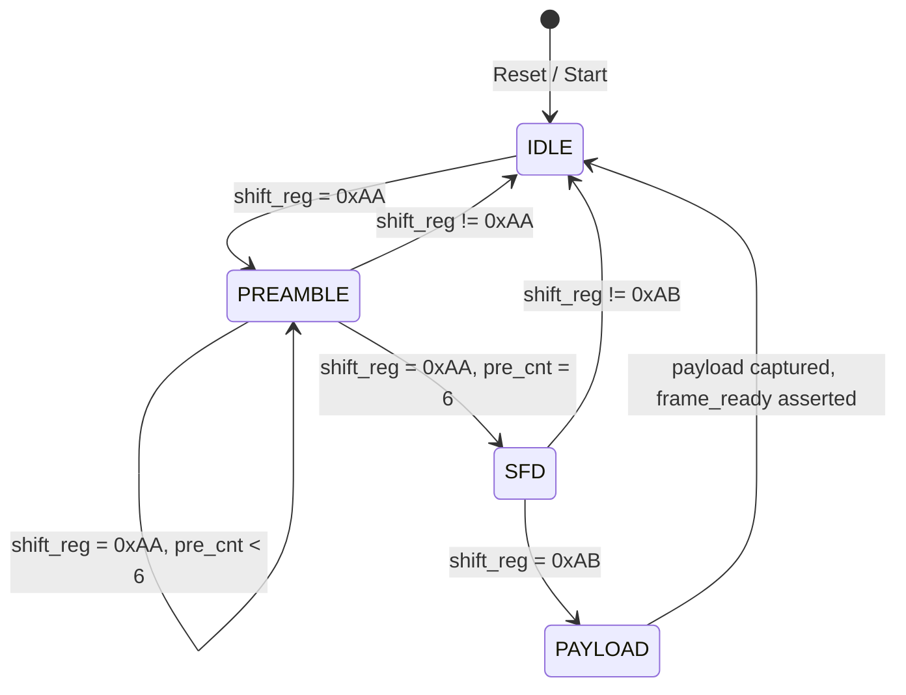
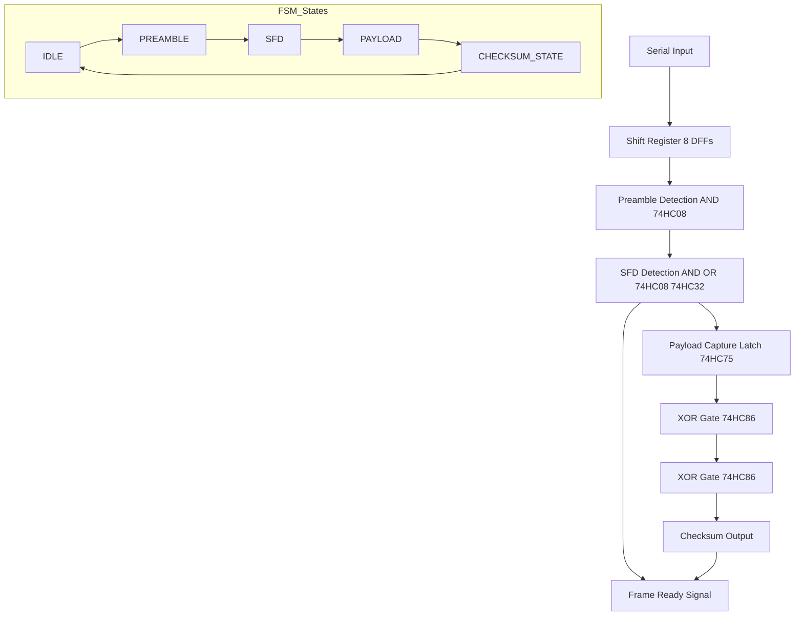

# Mini Ethernet PHY (VHDL)  

## Overview

This project implements a **minimal Ethernet-like PHY** in VHDL-2008 using GHDL.  
It is designed to teach and demonstrate:

- Serial-to-byte conversion (bitstream → byte)
- Preamble + SFD detection
- Payload extraction
- Deterministic testbench with clock-synchronous assertions
- Simulation using GHDL and waveform inspection via GTKWave

The design is suitable for **learning purposes** and can later be mapped to **74HC logic blocks** or FPGA CLBs.

---

## Project Structure

```

mini_ethernet_phy/
├── images
├── Makefile
├── README.md
├── mini_ethernet_phy.vhd
└── tb_mini_ethernet_phy.vhd

````

### Files

- **mini_ethernet_phy.vhd**: The DUT (Device Under Test) implementing the RX FSM
- **tb_mini_ethernet_phy.vhd**: Testbench sending preamble, SFD, and payload bits
- **Makefile**: Automates compilation, elaboration, simulation, and waveform generation

---

## Design Description

### DUT Architecture

- **Inputs**
  - `clk`: system clock
  - `rst`: synchronous reset
  - `din`: serial data input
- **Outputs**
  - `payload_out`: 4-bit payload captured from the frame
  - `frame_ready`: asserted when a full frame is detected
- **Internal Signals**
  - `shift_reg`: 8-bit shift register for serial-to-byte conversion
  - `byte_reg`: holds the fully assembled byte for FSM
  - `bit_cnt`: counts bits 0..7
  - `pre_cnt`: counts number of preamble bytes received
  - `byte_valid`: pulse indicating a full byte is ready for FSM

### FSM States

| State       | Description                                             |
|-------------|---------------------------------------------------------|
| IDLE        | Waiting for first preamble byte                         |
| PREAMBLE    | Counting preamble bytes (expect 7 consecutive 0xAA)    |
| SFD         | Expecting start-of-frame delimiter 0xAB               |
| PAYLOAD     | Latch payload and assert `frame_ready`                |

---

## Testbench

- Clock: 10 ns period
- Sends **7× preamble bytes (0xAA)**, **SFD (0xAB)**, and **1 payload byte (0xA0)**
- Waits for `frame_ready` signal **synchronously on clock edge**
- Asserts `payload_out` is correct
- Contains **watchdog timeout** to prevent infinite simulation
- Generates waveform `wave.vcd` for GTKWave inspection

---

 </img>

---

## Usage

### Prerequisites

- [GHDL](https://ghdl.github.io/ghdl/) (VHDL-2008 support)
- GTKWave (optional, for waveform viewing)

### Build and Simulate

```bash
# Compile, elaborate, and run simulation
make
````

### View Waveform

```bash
make view
```

### Clean Artifacts

```bash
make clean
```

---

## Makefile Targets

| Target  | Description                                      |
| ------- | ------------------------------------------------ |
| all     | Default target (`run`)                           |
| analyze | Analyze (compile) all VHDL files                 |
| elab    | Elaborate the top entity                         |
| run     | Run simulation and generate `wave.vcd`           |
| view    | Open GTKWave to inspect waveform                 |
| clean   | Remove compiled objects, simulation outputs, VCD |

---

## Key Lessons Learned

1. **Never compare shift register in the same cycle it is shifted** — must latch a byte first.
2. **Synchronize testbench to clock** to avoid missing 1-cycle pulses.
3. **Use watchdogs** in simulation to prevent infinite loops.
4. **Stop simulation explicitly** to control VCD file size.
5. **Byte alignment and FSM timing** is crucial for protocol correctness.


## DUT FSM Diagram




---

### ✅ How it works

- `IDLE` waits for the first preamble byte.
- `PREAMBLE` counts 7 consecutive `0xAA` bytes.
- `SFD` detects the start-of-frame delimiter `0xAB`.
- `PAYLOAD` captures the payload and asserts `frame_ready`.
- Any unexpected byte in `PREAMBLE` or `SFD` returns to `IDLE`.

---

Great! Let’s make a **textual/ASCII-style schematic** showing how this mini Ethernet PHY could be implemented using **74HC ICs**—D flip-flops for the shift register, AND gates for preamble detection, XOR gates for checksum, and a latch for payload.

---

### **Mini Ethernet PHY with 74HC ICs (Textual Schematic)**



---

### **Mapping to 74HC ICs**

| Function                      | 74HC IC Example                              |
| ----------------------------- | -------------------------------------------- |
| Shift register / D flip-flops | 74HC74                                       |
| Preamble AND gates            | 74HC08 (AND)                                 |
| SFD Check (OR/AND logic)      | 74HC08 + 74HC32                              |
| Payload latch                 | 74HC75 (4-bit latch)                         |
| XOR Checksum                  | 74HC86 (XOR gates)                           |
| Control logic / FSM           | 74HC00 / 74HC02 (NAND/NOR for state machine) |

---

### **How it works**

1. **Shift register**: 8 D flip-flops capture incoming serial bits.
2. **Preamble detection**: AND gates detect 7 consecutive `10101010` bytes.
3. **SFD detection**: logic verifies the start frame delimiter `10101011`.
4. **Payload latch**: stores the 4-bit payload in parallel.
5. **Checksum**: XOR of payload bits.
6. **Frame Ready**: output signal goes high when the frame is valid.
7. **FSM**: implemented with NAND/NOR gates to control states (IDLE → PREAMBLE → SFD → PAYLOAD → CHECKSUM → IDLE).

---

This **textual schematic** gives you a **realistic CLB/74HC-level layout** of a mini PHY.

---


## References

* [GHDL Documentation](https://ghdl.github.io/ghdl/)
* [Ethernet preamble/SFD convention: 7× 0xAA + 0xAB](https://sierrahardwaredesign.com/basic-networking/what-is-the-preamble-within-the-ethernet-frame/)
* VHDL-2008 shift-register design patterns
* Professional RTL verification techniques
